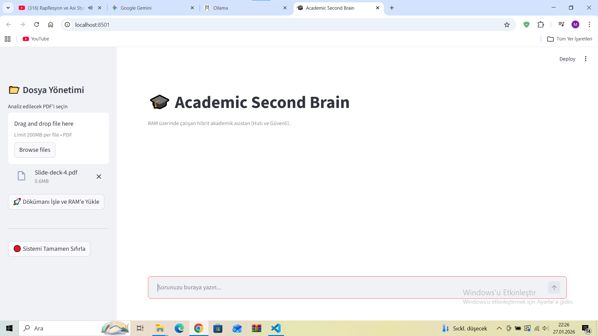

# Academic Second Brain: Local RAG-Based AI Assistant




Academic Second Brain, gizlilik odaklı ve tamamen yerel (local) çalışan, akademik dökümanları analiz edebilen hibrit bir yapay zeka asistanıdır. Kullanıcılar PDF dökümanlarını yükleyerek spesifik teknik sorular sorabilir veya asistanın genel akademik bilgisinden (dil bilgisi, matematik, felsefe vb.) yararlanabilirler.

---

## 🚀 Öne Çıkan Özellikler

- **Yerel LLM Entegrasyonu**: Verileriniz internete çıkmaz; Ollama aracılığıyla Llama 3.2 3B modeli tamamen yerel makinede çalışır.

- **Hibrit Bilgi Sistemi**: Soru dökümanla ilgiliyse RAG (Retrieval-Augmented Generation) mekanizması, genel bir konuysa LLM'in önceden eğitilmiş genel bilgisi devreye girer.

- **Akıllı Kaynak Gösterme**: Cevap dökümandan alındığında, bilginin hangi sayfadan geldiği otomatik olarak 📍 *(Kaynak: Sayfa X)* şeklinde belirtilir.

- **In-Memory Vector Store**: Windows işletim sistemindeki dosya kilitleme hatalarını (WinError 32) önlemek ve maksimum hıza ulaşmak için veritabanı (ChromaDB) RAM üzerinde çalışır.

- **Gelişmiş Metin İşleme**: Dökümanlar, anlam bütünlüğünü korumak adına akıllı parçalama (Recursive Character Splitting) yönteminden geçer.

---

## 🛠️ Teknik Mimari

Proje, modern bir AI boru hattı (pipeline) üzerine inşa edilmiştir:

1. **Ingestion**: PDF dökümanları `PyPDFLoader` ile taranır.
2. **Processing**: Metinler HuggingFace embedding modelleri (`all-MiniLM-L6-v2`) kullanılarak vektörleştirilir.
3. **Storage**: Vektörler RAM üzerindeki ChromaDB içerisinde geçici olarak saklanır.
4. **Retrieval**: Kullanıcı sorusuna en yakın anlam parçaları (chunks) anlık olarak geri çağrılır.
5. **Generation**: Prompt Engineering teknikleriyle LLM'e bağlam (context) sunulur ve yanıt üretilir.

---

## 📦 Kurulum ve Çalıştırma

### Gereksinimler

- Python 3.10+
- Ollama (Llama 3.2 modeli yüklü olmalıdır)

### Adımlar

1. **Depoyu klonlayın:**
   ```bash
   git clone https://github.com/mahmutari/academic-ai-bot.git
   cd academic-ai-bot
   ```

2. **Gerekli kütüphaneleri kurun:**
   ```bash
   pip install -r requirements.txt
   ```

3. **Ollama'da Llama 3.2 modelini yükleyin:**
   ```bash
   ollama pull llama3.2
   ```

4. **Uygulamayı başlatın:**
   ```bash
   streamlit run app.py
   ```

5. **Tarayıcınızda açılan arayüzü kullanın** (genellikle `http://localhost:8501`)

---

## 💡 Kullanım

1. Uygulamayı başlattıktan sonra sol taraftaki sidebar'dan PDF dosyanızı yükleyin
2. "Dökümanı İşle" butonuna tıklayın
3. Soru kutusuna akademik sorunuzu yazın
4. Asistan, eğer cevap dökümanda varsa kaynak sayfa numarasıyla birlikte yanıt verecektir

---

## 📈 Gelecek Çalışmalar (Future Work)

Projenin gelişim vizyonu şu hedefleri içermektedir:

- [ ] **Global Summarization**: Dökümanın tamamını tek seferde özetleyebilen büyük bağlamlı modellerin entegrasyonu
- [ ] **Multi-Document Support**: Aynı anda birden fazla PDF üzerinde çapraz sorgulama yeteneği
- [ ] **Dark Mode & UI**: Daha gelişmiş bir kullanıcı deneyimi için karanlık mod ve PDF önizleme paneli
- [ ] **Advanced Search**: Semantic search ve keyword search kombinasyonu
- [ ] **Export Options**: Soru-cevap geçmişini PDF veya Markdown olarak dışa aktarma

---

## 🤝 Katkıda Bulunma

1. Bu depoyu fork edin
2. Yeni bir branch oluşturun (`git checkout -b feature/amazing-feature`)
3. Değişikliklerinizi commit edin (`git commit -m 'feat: Add amazing feature'`)
4. Branch'inizi push edin (`git push origin feature/amazing-feature`)
5. Bir Pull Request açın

---


## 🙏 Teşekkürler

Bu proje aşağıdaki açık kaynak teknolojileri kullanmaktadır:

- [LangChain](https://github.com/langchain-ai/langchain)
- [Ollama](https://ollama.ai/)
- [ChromaDB](https://www.trychroma.com/)
- [Streamlit](https://streamlit.io/)
- [HuggingFace](https://huggingface.co/)

---

